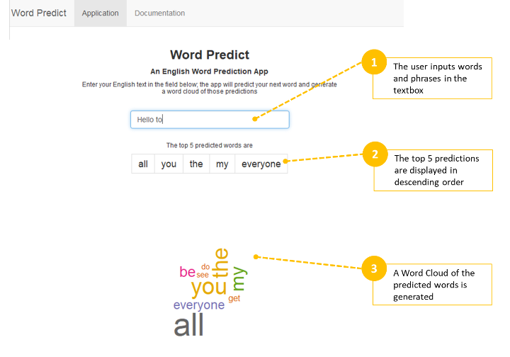

WordPredict: A Word Prediction Application 
========================================================
author: Joseph Fabia
date: April 2, 2019
transition: rotate

Overview
========================================================

This presentation serves as pitch for a Shiny App that was created in partial fulfillment of Coursera's Data Science Specialization Course by John Hopkins University. The application is available at this [link](https://jfabia.shinyapps.io/WordPredict/), while the source code of the app is available at this [repository](https://github.com/jfabia/dsscapstone). 

The aim of this project is to create an application that will predict the next english word based on a combination of words provided by the user. Data used for the prediction algorithm is provided by SwiftKey, who partnered with John Hopkins University for this project. The data is used to build a Word Corpus, which in turn is used to build n-gram language models, which are probability distributions of how frequent combination of words appear. Using these n-grams, the Stupid Backoff method is applied when predicting the next word. The application will display the top five predictions in descending order, and will also display of wordcloud of all the results.   

 

The Data
========================================================

Data is provided by SwiftKey and is derived from blogs, tweets and news sites in english.

We use the data to create a corpus, or a collection of words and phrases based on the english language. 

To strike a balance between completeness (capturing data of conversational english) and manageability (dataset size and processing speed), we use 100% of data from news sites, 60% of the data from blogs, and 20% of the data from twitter. The selected data leans towards data from blogs and news sites, since it is expected that phrases from these are proof-read and therefore more accurate. While data from twitter is sufficiently large, there can be issues with data integrity (ex: misspelled words and internet slang)

We clean this data by removing special characters, URLs, numbers, punctuations, plain text, and profanity. The list of profanity is based on the data from an article on Free Web Headers, which can be downloaded from [this site](https://www.freewebheaders.com/download/files/full-list-of-bad-words_text-file_2018_07_30.zip). It is also available in the [github repository](https://github.com/jfabia/dsscapstone/tree/master/devtcode/orig_data)

[Contractions](https://edu.gcfglobal.org/en/grammar/contractions/1/) were included words in building our corpus, since they represent a combination of two words and are common in conversational english.

[Stopwords](https://en.wikipedia.org/wiki/Stop_words) were included in building the corpus, since they are common phrases in conversational english.

The actual code used to download, compile and clean the data is found [in the app's repository](https://github.com/jfabia/dsscapstone/tree/master/devtcode).

The Algorithm & Application
========================================================

Once the corpus has been prepared, it is processed using [tokenization](https://nlp.stanford.edu/IR-book/html/htmledition/tokenization-1.html), a process of breaking a series of text into words or phrases. These are then used to produce [N-grams](https://en.wikipedia.org/wiki/N-gram), which are distribution models of a series of words found in the corpus. For this app, we use 2-grams, 3-grams, 4-grams and 5-grams.

Once the n-grams are set, a predictive model is trained using each n-gram using the [Stupid Backoff scheme](https://www.aclweb.org/anthology/D07-1090.pdf). The idea is to use the first words in a phrase, and given those determine what's the next word based on the rank distribution in the n-gram.

The application applies the predictive model by looking at the user's current input in the given textbox, and then to apply Stupid Backoff starting at the x-gram, where x is the number of words input, and then working backwards until the 2-gram is reached.

Once the algorithm is run, the model stores the results and:
- outputs the top 5 words predicted
- outputs a wordcloud based on all words predicted

The actual code used to build the n-gram and predictive model is found [in the app's github repository](https://github.com/jfabia/dsscapstone/tree/master/devtcode), and the shiny app is found [at this link](https://jfabia.shinyapps.io/WordPredict/).

The User Interface
========================================================

The application was built in Shiny with the intention of keeping the user experience simple and straightforward while maximizing prediction accuracy and processing efficiency. 

The application is suitable both for standard PCs, laptops, and most mobile devices.

 

